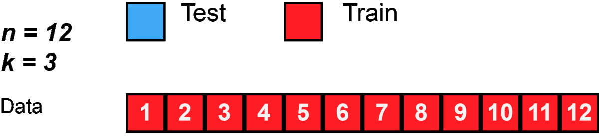

# Cross-Validation #

Cross-validation, sometimes called rotation estimation or out-of-sample testing, is any of various similar model validation techniques for assessing how the results of a statistical analysis will generalize to an independent data set. It is mainly used in settings where the goal is prediction, and one wants to estimate how accurately a predictive model will perform in practice. In a prediction problem, a model is usually given a dataset of known data on which training is run (training dataset), and a dataset of unknown data (or first seen data) against which the model is tested (called the validation dataset or testing set). The goal of cross-validation is to test the model's ability to predict new data that was not used in estimating it, in order to flag problems like overfitting or selection bias and to give an insight on how the model will generalize to an independent dataset (i.e., an unknown dataset, for instance from a real problem).

One round of cross-validation involves partitioning a sample of data into complementary subsets, performing the analysis on one subset (called the training set), and validating the analysis on the other subset (called the validation set or testing set). To reduce variability, in most methods multiple rounds of cross-validation are performed using different partitions, and the validation results are combined (e.g. averaged) over the rounds to give an estimate of the model's predictive performance.

In summary, cross-validation combines (averages) measures of fitness in prediction to derive a more accurate estimate of model prediction performance.

#### Types ####

:triangular_flag_on_post: Exhaustive cross-validation

Exhaustive cross-validation methods are cross-validation methods which learn and test on all possible ways to divide the original sample into a training and a validation set.

:triangular_flag_on_post: Non-exhaustive cross-validation

Non-exhaustive cross validation methods do not compute all ways of splitting the original sample. Those methods are approximations of leave-p-out cross-validation.

### :large_blue_diamond: How does Cross-Validation work? ###

Cross-validation is used to test the generalizability of the model.
As we train any model on the training set, it tends to overfit most of the time, and in order to avoid this situation, we use regularization techniques. Cross-validation provides a check on how it is performing on a test data (new unseen data), and since we have limited training instances, we need to be careful while reducing the amount of training samples and reserving it for testing purpose.
The best way to improve the performance of the system without compromising much would be to use a small part of the training data itself to validate, as it might give us an idea of the model's ability to predict unseen data.
K-fold is a popular kind of cross-validation technique, in which, say k=10 for example, 9 folds for training and 1 fold for testing purpose and this repeats unless all folds get a chance to be the test set one by one. This way, it provides a good idea of the generalization ability of the model, especially when we have limited data and can't afford to split into test and training data.

### :large_blue_diamond: Advantages of Cross-Validation ###

:heavy_check_mark: More accurate estimate of out-of-sample accuracy.

:heavy_check_mark: More “efficient” use of data as every observation is used for both training and testing..

:heavy_check_mark: Reduces Overfitting.

:heavy_check_mark: Hyperparameter Tuning.

### :large_blue_diamond: Disadvantages of Cross-Validation ###

:x:  Increases Training Time.

:x: Needs Expensive Computation.

## Most commonly used Cross Validations ##

### K-Fold Cross Validation ### 
In K-Folds Cross Validation we split our data into k different subsets (or folds). We use k-1 subsets to train our data and leave the last subset (or the last fold) as test data. We then average the model against each of the folds and then finalize our model. After that we test it against the test set.

### Leave One Out Cross Validation (LOOCV) ###
This is another method for cross validation, Leave One Out Cross Validation (by the way, these methods are not the only two, there are a bunch of other methods for cross validation. Check them out in the Sklearn website). In this type of cross validation, the number of folds (subsets) equals to the number of observations we have in the dataset. We then average ALL of these folds and build our model with the average. We then test the model against the last fold. Because we would get a big number of training sets (equals to the number of samples), this method is very computationally expensive and should be used on small datasets. If the dataset is big, it would most likely be better to use a different method, like kfold.

#### Do you want to learn more? Click here. ####
[Cross-Validation Wikipedia page](https://en.wikipedia.org/wiki/Cross-validation_(statistics))

 
:arrow_lower_right: References:

[Link 1](https://www.geeksforgeeks.org/cross-validation-machine-learning/)

[Link 2](https://github.com/encodedANAND/K-Fold-Cross-Validation)

[Link 3](https://www.geeksforgeeks.org/cross-validation-machine-learning/)

[Link_4](https://towardsdatascience.com/train-test-split-and-cross-validation-in-python-80b61beca4b6)
