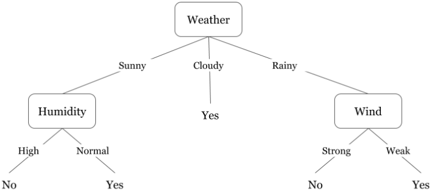

# Decision Trees Algorithm
---
* **Characteristics**
    - Supervised Learning
    - Classification and Regression Tasks
    - Goal: Create a model that predicts the value of a target variable by learning simple decision rules inferred from the data features

* **Advantages**
    1) Requires less effort for data preparation during pre-processing
    2) Does not require normalization of data
    3) Does not require scaling of data 
    4) Missing values in the data do NOT affect the process of building a decision tree to any considerable extent
    5) Very intuitive and easy to explain to technical teams as well as stakeholders
    
* **Disadvantages**
    1) A small change in the data can cause a large change in the structure of the decision tree causing instability.
    2) For a Decision tree sometimes calculation can go far more complex compared to other algorithms.
    3) Decision tree often involves higher time to train the model.
    4) Decision tree training is relatively expensive as the complexity and time taken are more.
    5) Decision Tree algorithm is inadequate for applying regression and predicting continuous values.

* **Introduction**
    - Tree-like graph with nodes representing the place where we pick an attribute and ask a question; edges represent the answers the to the question; and the leaves represent the actual output or class label.
    - Used in Non-linear decision making with simple linear decision surface. 
    - Decision trees classify the examples by sorting them down the tree from the root to some leaf node, with the leaf node providing the classification to the example. Each node in the tree acts as a test case for some attribute, and each edge descending from that node corresponds to one of the possible answers to the test case. This process is recursive in nature and is repeated for every subtree rooted at the new nodes.

* **Example**
Let's assume we want to play badminton on a particular day — say Saturday — how will you decide whether to play or not. Let's say you go out and check if it's hot or cold, check the speed of the wind and humidity, how the weather is, i.e. is it sunny, cloudy, or rainy. You take all these factors into account to decide if you want to play or not.

So, you calculate all these factors for the last ten days and form a lookup table like the one below.

Table 1. Obeservations of the last ten days.

Now, you may use this table to decide whether to play or not. But, what if the weather pattern on Saturday does not match with any of rows in the table? This may be a problem. A decision tree would be a great way to represent data like this because it takes into account all the possible paths that can lead to the final decision by following a tree-like structure.

Fig 2. A decision tree for the concept Play Badminton (when attributes are continuous)

A general algorithm for a decision tree can be described as follows:

1) Pick the best attribute/feature. The best attribute is one which best splits or separates the data.
2) Ask the relevant question.
3) Follow the answer path.
4) Go to step 1 until you arrive to the answer.
The best split is one which separates two different labels into two sets.

* **Reference**

https://www.hackerearth.com/practice/machine-learning/machine-learning-algorithms/ml-decision-tree/tutorial/
