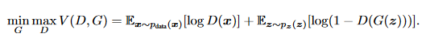
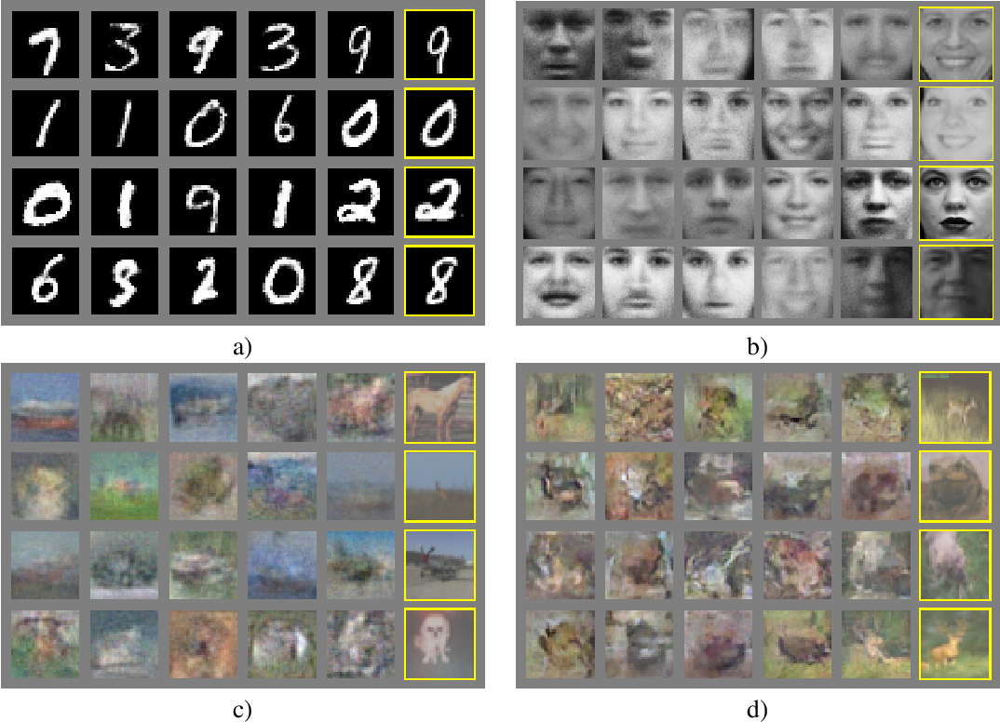

# A simple introduction to Generative Adversarial Networks (GANs) #

## Generative Model ##

The main goal of all kinds of generative model is to use the training data to generative new examples that 'look' like it. This is a kind of unsupervised learning.
Thus Generative models try to learn the true data distribution of the training set so as to generate new data points that are plausible and indistinguishable from real examples from the problem domain.  

## GANs ##

Sometimes the true distribution of input data is too complex to be learned exact. For example, suppose we want generate pictures of dog. We have many training examples
consisting of pictures of dogs. But it may not be possible to learn the exact distribution of the dogs' features. We try to model a distribution which is as similar as possible to the true data distribution. Generative adversarial networks(GANs) are examples of generative models which performs this task of generating new samples, and are judged primarily by the similarity of generated samples to actual inputs.

   
  <em>GAN learning to generate images</em>

## How does it work? ##

The GAN model is usually implemented using two neural networks - Generator and Discriminator.
Generator : Model that is used to generate new data similar to the samples.
Discriminator : Model that is used to classify examples as real (from the domain) or fake (generated). 
The two models compete in a two-player game, both teams tries improve their methods until the generated samples cannot be distinguished from the real ones that is
the Generator succeeds in creating realistic data.

_`" The generative model can be thought of as analogous to a team of counterfeiters,trying  to  produce  fake  currency  and  use  it  without  detection,  while  the  discriminative  model is analogous to the police, trying to detect the counterfeit currency. "`_ - [Generative Adversarial Networks, 2014](https://arxiv.org/abs/1406.2661)

   
  <em>Example of the Generative Adversarial Network Model Architecture</em>

##  Mathematically Modeling a GAN ##
The Generator will be implemented as a neural network G(z,θg) which represents a mapping from the input noise variables z to our data space x with parameters or the weights as θg. The Discrimanator will be our second neural network D(x,θd) which outputs a single value that represents probability of x being real meaning it came from our data rather than generated by the generator. Discrimator will be trained so that it assign correct label to the data coming from sample and the generator. It will try to maximise log D(x) when x comes from our data and try to minimise log D(G(z)) or maximise log (1-D(G(z))), 
G(z) is sample generated by the generator.
On the other hand, Generator will try to minimise the probability of the discriminator classifying the sample generated by it as fake.
It will try to minimise log(1-D(G(z))).
Thus D and G plays a minmax game as follows :-

 

  

After several steps of training, if G and D have enough capacity, they will reach point at which the discriminator is unable to differentiate between the two distributions, i.e. D(x) = 1&frasl;2

   
  <em>These are samples generated by Generative Adversarial Networks after training on the following datasets: a) MNIST b)TFD c) CIFAR-10 (fully connected model) d) CIFAR-10 (convolutional discriminatorand “deconvolutional” generator).Rightmost column shows the nearest training example ofthe neighboring sample, in order to demonstrate that the model has not memorized the training set. ( Source : <a href = "https://arxiv.org/abs/1406.2661"> Generative Adversarial Networks, 2014 )</a></em>

## <b> References </b>
- https://arxiv.org/abs/1406.2661
- https://openai.com/blog/generative-models/
- https://machinelearningmastery.com/what-are-generative-adversarial-networks-gans/
- https://en.wikipedia.org/wiki/Generative_model

_<b>Thank you!</b>_
