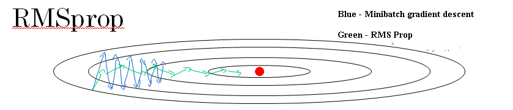

#RMSprop
---
* **Origin of RMSprop**
	
	- RMSprop stands for root mean square prop
	- It was proposed by the father of Deep Learning Geoffrey Hinton while teaching online course on coursera "Neural Network for Machine Learning".
	- He didn't publish RMSprop in a formal academic paper.
	 
* **Concept of RMSprop**
	- It's a gradient based optimization technique used to train neural networks with much fast speed. 
	
* **How it works**
	
	- In gradient descent, you can end up with huge oscillations in the vertical direction, even while it's trying to converge in the horizontal direction. 
	- Assuming,vertical axis - b and horizontal axis - W.
	- Ultimately the goal is to have minimize the progress/learning in the vertical direction and speed up learning/progress in the horizontal direction.

	- Peudso Code
	
	```
	sdW = 0, sdb = 0
	
	on iteration t:
	
	# can be mini-batch or batch gradient descent
	compute dw, db on current mini-batch
	
	sdW=(beta * sdW) + (1- beta) * dW^2
	sdb=(beta * sdb) + (1- beta) * db^2
	W = W- learning_rate * dW / sqrt(sdW)
	b = b- learning_rate * db / sqrt(sdb)
	
	```

	- On iteration t, it will compute as usual the derivative dW, db on the current mini-batch.Here beta,learning_rate(Alpha) are hyperparameters.
	- The squaring operation is an element-wise squaring operation(dW^2 and db^2). So what this is doing is really keeping an exponentially weighted average of the squares of the derivatives.
	- We're hoping is that SdW will be relatively small, so that we're dividing dW by relatively small number in order to update fast in horizontal direction.
	- We're hoping is that Sdb will be relatively large, so that here we're dividing dB by relatively large number in order to slow down updates in vertical direction.
	- So the net effect of this is that your updates in the vertical direction are divided by a much larger number, and so that helps damp out the oscillations.
	- Ensure that sdW is not zero by adding a small value epsilon (e.g. epsilon = 10^-8 ) to it W = W - learning_rate * dW / (sqrt(sdW) + epsilon).
	


* **References:**


