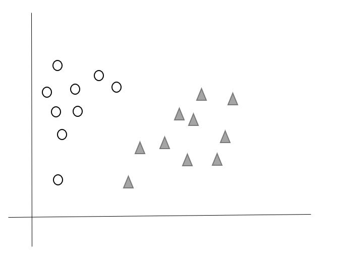
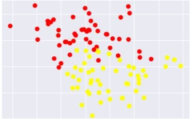
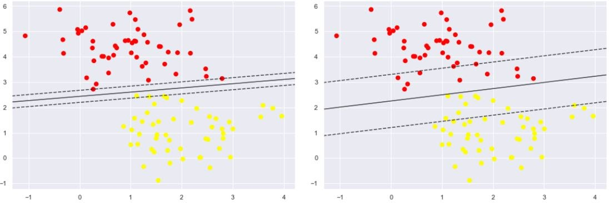
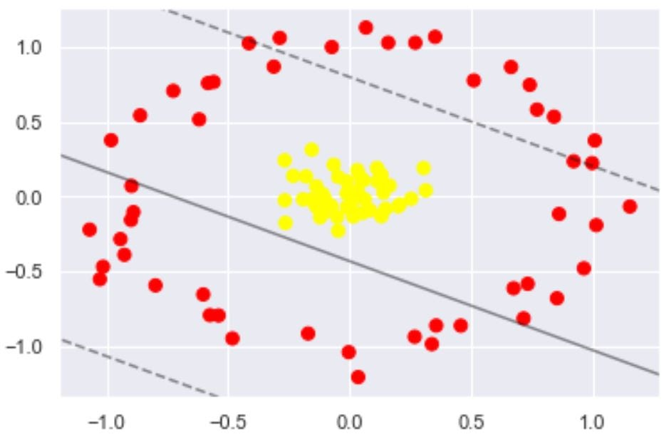

# Support vector machine <SVM> #

A support vector machine (SVM) is machine learning algorithm that analyzes data for classification and regression analysis. SVM is a supervised learning method that looks at data and sorts it into one of two categories. An SVM outputs a map of the sorted data with the margins between the two as far apart as possible. SVMs are used in text categorization, image classification, handwriting recognition and in the sciences.

A support vector machine is also known as a support vector network (SVN). Also is a supervised learning algorithm that sorts data into two categories. It is trained with a series of data already classified into two categories, building the model as it is initially trained. The task of an SVM algorithm is to determine which category a new data point belongs in. This makes SVM a kind of non-binary linear classifier. It was introduced in the late 1990s and successfully applied to many engineering related applications

An SVM algorithm should not only place objects into categories, but have the margins between them on a graph as wide as possible.

Some applications of SVM include:

- Text and hypertext classification
- Image classification
- Recognizing handwritten characters
- Biological sciences, including protein classification

In addition to performing linear classification, SVMs can efficiently perform a non-linear classification using what is called the kernel trick, implicitly mapping their inputs into high-dimensional feature spaces.

When data are unlabelled, supervised learning is not possible, and an unsupervised learning approach is required, which attempts to find natural clustering of the data to groups, and then map new data to these formed groups. The support-vector clustering algorithm, created by Hava Siegelmann and Vladimir Vapnik, applies the statistics of support vectors, developed in the support vector machines algorithm, to categorize unlabeled data, and is one of the most widely used clustering algorithms in industrial applications.

#### Applications/Usage to solve real-world problems: ####

:triangular_flag_on_post: SVMs are helpful in text and hypertext categorization, as their application can significantly reduce the need for labeled training instances in both the standard inductive and transductive settings. Some methods for shallow semantic parsing are based on support vector machines.

:triangular_flag_on_post: Classification of images can also be performed using SVMs. Experimental results show that SVMs achieve significantly higher search accuracy than traditional query refinement schemes after just three to four rounds of relevance feedback. This is also true for image segmentation systems, including those using a modified version SVM that uses the privileged approach as suggested by Vapnik.

:triangular_flag_on_post: Classification of satellite data like SAR data using supervised SVM.

:triangular_flag_on_post: Hand-written characters can be recognized using SVM.

:triangular_flag_on_post: The SVM algorithm has been widely applied in the biological and other sciences. They have been used to classify proteins with up to 90% of the compounds classified correctly. Permutation tests based on SVM weights have been suggested as a mechanism for interpretation of SVM models. Support-vector machine weights have also been used to interpret SVM models in the past. Posthoc interpretation of support-vector machine models in order to identify features used by the model to make predictions is a relatively new area of research with special significance in the biological sciences.

### :large_blue_diamond: How does Support vector machine work? ###

#### 1. Linearly Separable Data ####
 
Let us understand the working of SVM by taking an example where we have two classes that are shown is the below image which are a class A: Circle & class B: Triangle. Now, we want to apply the SVM algorithm and find out the best hyperplane that divides the both classes.

SVM takes all the data points in consideration and gives out a line that is called ‘Hyperplane’ which divides both the classes. This line is termed as ‘Decision boundary’. Anything that falls in circle class will belong to the  class A and vice-versa.

There can be many hyperplanes that you can see but the best hyper plane that divides the two classes would be the hyperplane having a large distance from the hyperplane from both the classes. That is the main motive of SVM to find such best hyperplanes.

There can be different dimensions which solely depends upon the features we have. It is tough to visualize when the features are more than 3.

Consider we have two classes that are red and yellow class A and B respectively. We need to find the best hyperplane between them that divides the two classes. 

Soft margin permits few of the above data points to get misclassified. Also,it tries to make the balance back and forth between finding a hyperplane that attempts to make less misclassifications and maximize the margin.

#### 2. Linearly Non-separable Data ####

If the data is non linearly separable as shown in the above figure then SVM makes use of kernel tricks to make it linearly separable. The concept of transformation of non-linearly separable data into linearly separable is called Cover’s theorem - “given a set of training data that is not linearly separable, with high probability it can be transformed into a linearly separable training set by projecting it into a higher-dimensional space via some non-linear transformation”. Kernel tricks help in projecting data point to the higher dimensional space by which they became relatively more easily separable in higher dimensional space.

### :large_blue_diamond: Advantages of Support vector machine ###

:heavy_check_mark: Effective in high dimensional spaces.

:heavy_check_mark: Still effective in cases where number of dimensions is greater than the number of samples.

:heavy_check_mark: Uses a subset of training points in the decision function (called support vectors), so it is also memory efficient.

:heavy_check_mark: Versatile: different Kernel functions can be specified for the decision function. Common kernels are provided, but it is also possible to specify custom kernels.

### :large_blue_diamond: Disadvantages of Support vector machine ###

:x: If the number of features is much greater than the number of samples, avoid over-fitting in choosing Kernel functions and regularization term is crucial.

:x: SVMs do not directly provide probability estimates, these are calculated using an expensive five-fold cross-validation (see Scores and probabilities, below).

#### Do you want to learn more? Click here. ####
[Support vector machine Wikipedia page](https://en.wikipedia.org/wiki/Support_vector_machine#Computing_the_SVM_classifier)

:arrow_lower_right: References:

[Link 1](https://www.analyticssteps.com/blogs/how-does-support-vector-machine-algorithm-works-machine-learning)

[Link 2](https://www.techopedia.com/definition/30364/support-vector-machine-svm)

[Link 3](https://scikit-learn.org/stable/modules/svm.html)

[Link 4](https://www.sciencedirect.com/science/article/pii/B9780128113189000272)

[Link 5](https://towardsdatascience.com/i-support-vector-machines-and-so-should-you-7af122b6748)

